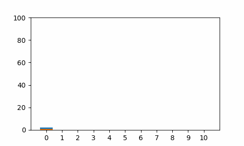
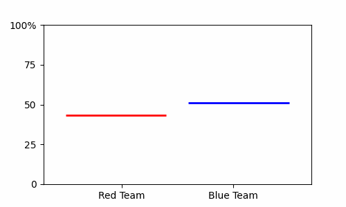
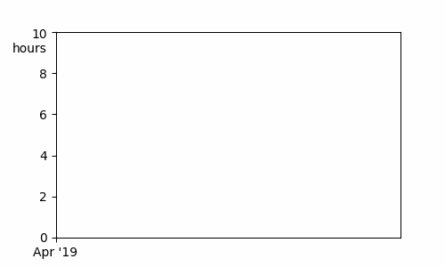

<div align="center">
  
</div>
<div align="center">
  <a href="https://calver.org/"></a>
  <a href="https://pypi.org/project/gif/"></a>
  <a href="https://pepy.tech/project/gif"></a>
</div>

### About

The [matplotlib](https://matplotlib.org/) Animation Extension


### Quickstart

Install

```sh
pip install gif
```

Usage

```python
import random
from matplotlib import pyplot as plt
import gif

x = [random.randint(0, 100) for _ in range(100)]
y = [random.randint(0, 100) for _ in range(100)]

# (Optional) Set the dots per inch resolution to 300:
gif.options.matplotlib["dpi"] = 300

# Decorate a plot function with @gif.frame (return not required):
@gif.frame
def plot(i):
    xi = x[i*10:(i+1)*10]
    yi = y[i*10:(i+1)*10]
    plt.scatter(xi, yi)
    plt.xlim((0, 100))
    plt.ylim((0, 100))

# Build a bunch of "frames"
frames = []
for i in range(10):
    frame = plot(i)
    frames.append(frame)

# Specify the duration between frames (milliseconds) and save to file:
gif.save(frames, 'example.gif', duration=50)
```


### Examples

| [](examples/arrival.py) | [](examples/hop.py) | [](examples/phone.py) |
| ------------------------------------------------------------ | ------------------------------------------------------------ | ------------------------------------------------------------ |
| [](examples/seinfeld.py) | [](examples/spiral.py) | [](love.py) |


### Warning

Altair and Plotly are no longer supported in `22.5.0`+

Please use `pip install gif==3.0.0` if you still need to interface with these libraries
